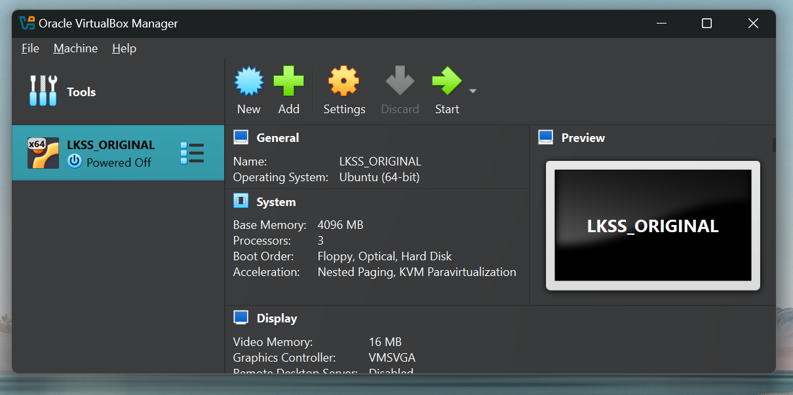
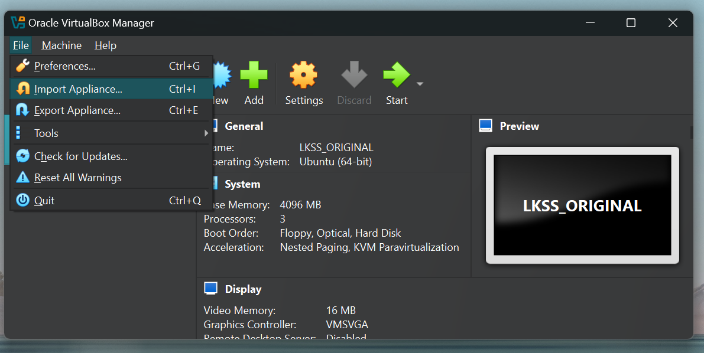
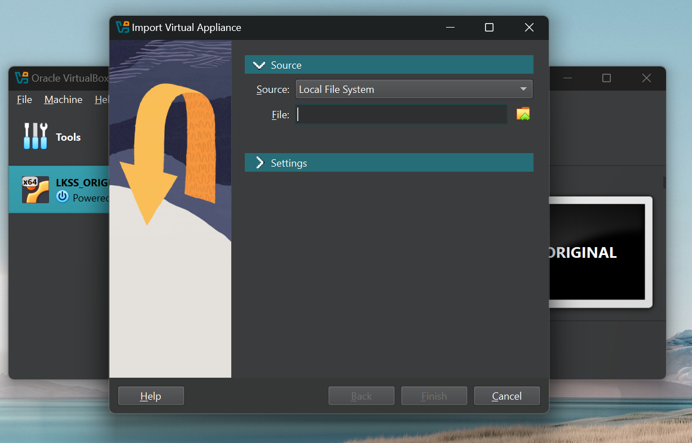
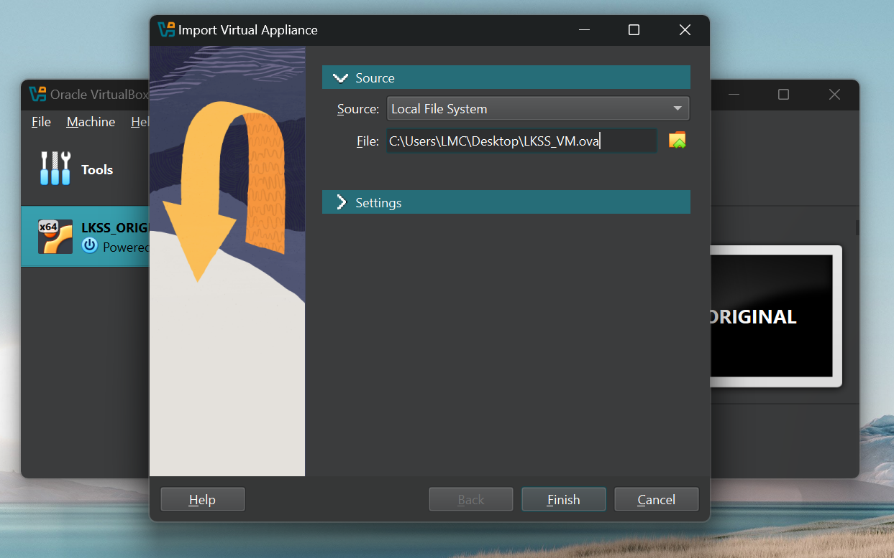
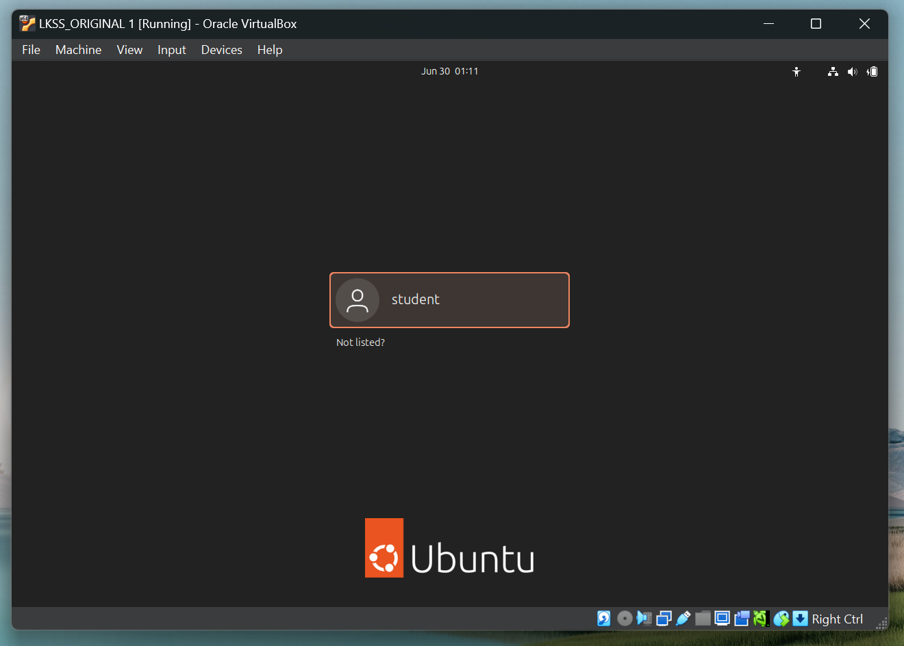
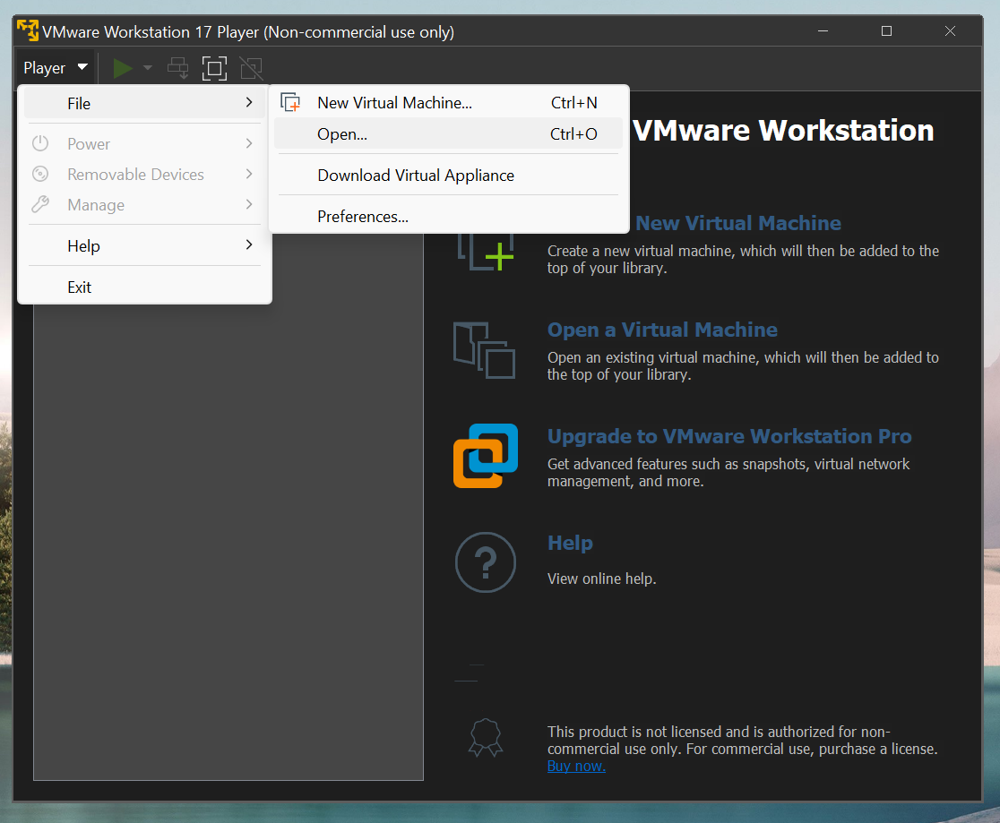
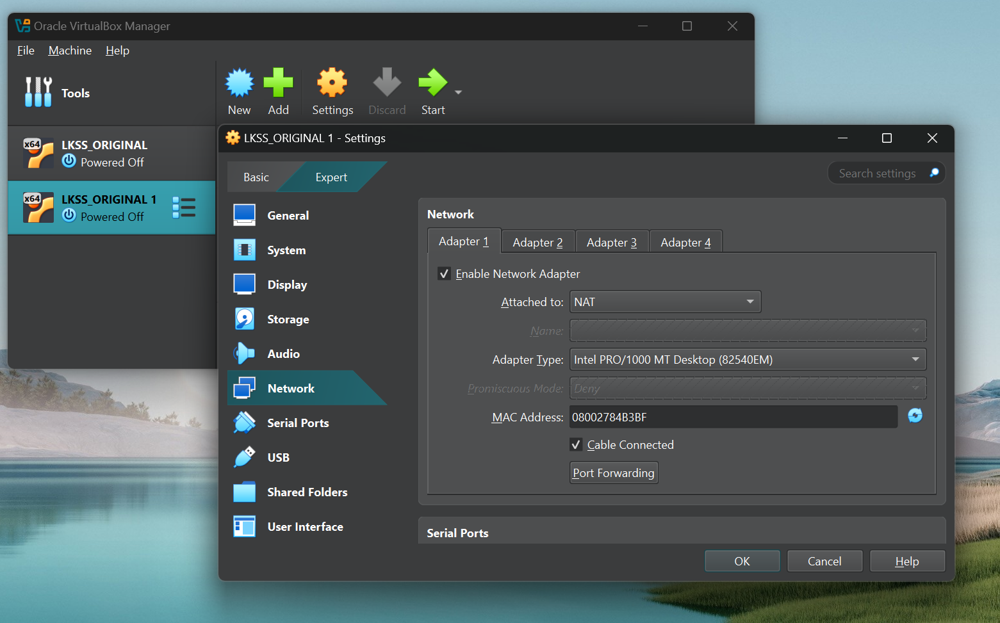
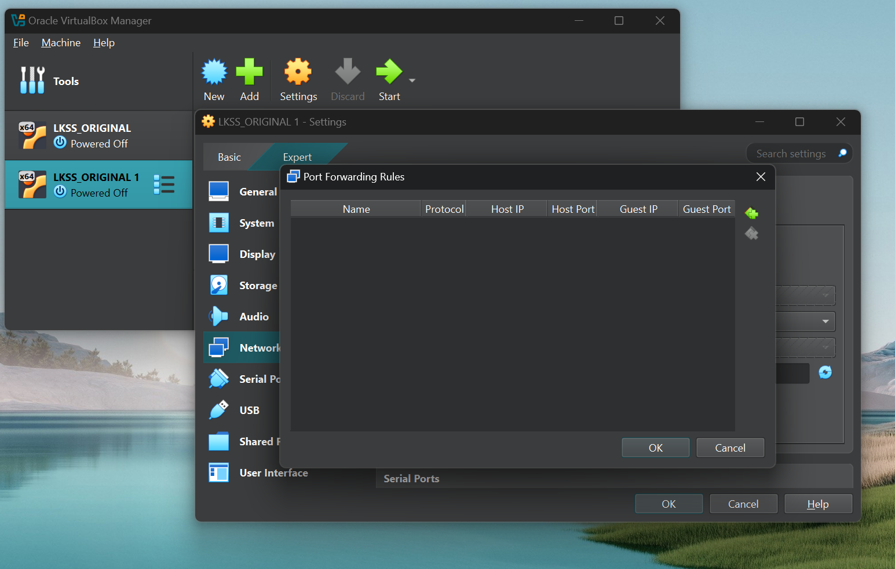

# LKSS 2025 edition infrastructure guide

Hello everyone and welcome to the **Linux Kernel Summer School (LKSS)** 2025
edition! This document shall guide you through the steps required for setting
up the environment required for this year's edition. The setup steps depend on
your host OS so please make sure you follow the appropriate section.

## Setting up the infrastructure for Windows-based systems

Since we are going to be working with the Linux kernel, we'll need a UNIX-based
system in which we can compile the Linux kernel and, generally, do our development.

### Running Linux in a Virtual Machine (VM)

For a Windows-based system, we can run a Linux distribution inside a **Virtual Machine**.
Before setting up the virtual machine, we're going to first have to install a virtual
machine manager (VMM). Some examples of free VMMs include:

1. VirtualBox ([download page](https://www.virtualbox.org/wiki/Downloads))
2. VMWare Workstation Player [^1]

Using any of the VMMs listed above is fine. If you already have one of them installed
then just go with that one :). You're also free to use any other VMM you wish although
this is not really recommended.

Now, after choosing and installing a VMM, it's time to boot our virtual machine!
For this year's edition, we're going to be providing you with a virtual machine, which
has all of the packages and utilities you're going to need. The OVA can be downloaded
from [here](https://drive.google.com/drive/folders/1gfQBi6mHruHgGcdT1p4FkDihwX9Cfx2m)

#### Importing the OVA using VirtualBox

When opening VirtualBox you should be greeted with an interface similar to the
one shown in the figure below (ignore the already existing LKSS\_ORIGINAL!):



To import the OVA you've downloaded in the previous step you'll need to go to
"File > Import Appliance..." as shown below:



You'll be prompted with the following menu:



In the "File" text box, make sure you select the previously downloaded
OVA as shown below:



If you need to change the directory in which VirtuaBox stores machine data
then you'll need to navigate to the "Settings" menu and then scroll down
until you find the "Machine Base Folder" text box.

When you're done, press "Finish" and let VirtualBox do its magic! After the
import operation is over you'll see your virtual machine in the left pane just
like the LKSS\_ORIGINAL from the first image.

To start the VM, you need to select it and then click "Start". If everything goes
well, you should see the Ubuntu login prompt:



Please use the following credentials:

* username: student
* password: student


And with this, we are done!

**Note: you are free to tweak the parameters of the machine (e.g. CPU number, memory, etc.)
as you see fit. You can do so by selecting the machine and then clicking on the "Settings"
button. The machine will have to be powered off for this.**

#### Importing the OVA using VMWare

When opening up VMWare you should be greeted with an interface similar
with the one shown below:


To import the OVA you'll have to go to "Player > File > Open" as shown below:



and then navigate through your file system until you find the OVA. After selecting
the OVA you'll be prompted with the following menu:


in which you'll have to give your VM a name and select the folder in which VMWare
will store the data associated with your VM. After you're done click on "Import".

When the import operation is over, select your VM and then click on the "Power On"
button (i.e. the green arrow head) to start it. If everything went well you'll be
greeted with the Ubuntu login prompt.

#### Setting up VirtualBox for SSH

You may need to transfer files between your host and guest machines or SSH
into your virtual machine for development purposes. To do this in VirtualBox
you're going to have to add a port forwarding rule. To do so, select your
virtual machine and then go to "Settings > Network" as shown below:



Then, click on the "Port forwarding" button. You should be prompted with the following
menu:



Click on the green plus sign on the right side and add the following rule:


Afterwards, click "OK" and start your VM. To SSH into your VM you can use:

```bash
ssh -p 3022 student@127.0.0.1
```

To transfer something from your host to your guest:

```bash
scp -P 3022 MY_AWESOME_FILE.zip student@127.0.0.1:/path/to/whatever/directory
```

### Potential issues and solutions

1. VirtualBox doesn't list any USB devices when right-clicking the USB icon.

Uninstall VirtualBox using the installer. After doing so, run the installer as
administrator and re-install.


## Setting up the infrastructure for Linux-based systems

Since you're already using a Linux-based distribution, you won't necessarily be
needing a virtual machine [^2]. Consequently, all that's left for you to do is
install the packages we'll be using for development and clone the LKSS repositories.
To install the required packages please run:

```bash
# required for cloning the repositories
sudo apt install git

# required for compiling the Linux kernel
sudo apt install build-essential libncurses-dev bc flex bison libssl-dev libelf-dev gcc-aarch64-linux-gnu

# misc
sudo apt install minicom
```

Before cloning the repositories you might want to create a directory in which
you can keep all of the LKSS-related code. For our VMs, we've chosen to place
everything under: "/home/student/work/repos". Of course, you are free to place
them wherever you see fit.

To install the required repositories please run:

```bash
# linux kernel source
git clone --depth=1 https://github.com/Linux-Kernel-Summer-School/linux.git

# utilities
git clone https://github.com/Linux-Kernel-Summer-School/lkss-utils
```

Additionally, when booting the board, we're going to be needing a filesystem,
which can be downloaded from here (TODO).


[^1]: This might not be free anymore. In case you don't already have this VMM
or the university doesn't provide free licenses anymore just go with VirtualBox.
[^2]: If you do wish to use a virtual machine then please follow the steps from
the "Setting up the infrastructure for Windows-based systems" section.
